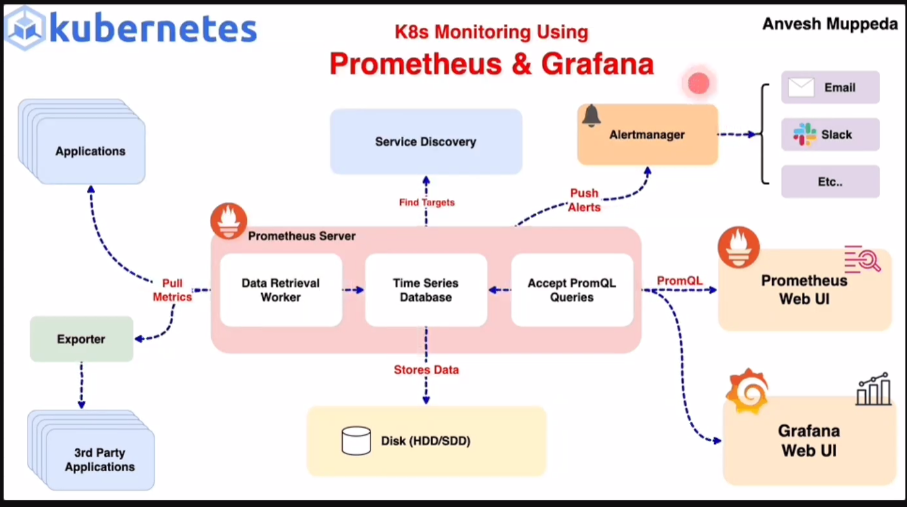

# MonitoringAndLogging

Prometheous and Grafana

sudo su -
apt update
apt -y install prometheus
service prometheus restart

prmoethous port is 9090
localhost:9090

The Prometheus configuration file is typically located at "/etc/prometheus/prometheus.yml"

https://sbcode.net/prometheus/alert-manager/

#!/bin/bash
# Update package list
sudo apt update
# Install Node Exporter
sudo apt install -y prometheus-node-exporter
# Start and enable Node Exporter service
sudo systemctl start prometheus-node-exporter
sudo systemctl enable prometheus-node-exporter

- job_name: "ApplicationServerMetrics"
    scrape_interval: 5s
    static_configs:
      - targets: ["54.224.216.179:9100"]

##Install Apache web server
apt update
apt -y install apache2
service apache2 restart
#Edit configuration on /etc/apache2/apache2.conf
ExtendedStatus On 

<Location /server-status> 
SetHandler server-status 
</Location>

##Install Apache web server
apt update
apt -y install apache2
service apache2 restart
Edit configuration on /etc/apache2/apache2.conf
ExtendedStatus On 
<Location /server-status> 
SetHandler server-status 
</Location> 
 

VERSION=0.11.0 
APACHE_USER_GROUP=apache 
APACHE_USER=apache 
wget https://github.com/Lusitaniae/apache_exporter/releases/download/v$VERSION/apache_exporter-$VERSION.linux-amd64.tar.gz
https://github.com/Lusitaniae/apache_exporter/releases/download/v1.0.8/apache_exporter-1.0.8.linux-amd64.tar.gz
tar xvzf apache_exporter-$VERSION.linux-amd64.tar.gz
chmod +x ./apache_exporter-0.11.0.linux-amd64/apache_exporter 
./apache_exporter-0.11.0.linux-amd64/apache_exporter --scrape_uri=http://localhost/server-status?auto --insecure --telemetry.address=:9117 --telemetry.endpoint=/metrics > /dev/null 2>&1 &

- job_name: "ApacheWebServerMetrics"
    scrape_interval: 5s
    static_configs:
      - targets: ["54.22.216.179:9117"]
    metrics_path: "/metrics"

#Deploy MySQL COntainer
docker run -d --name mysql -p 3306:3306 -e MYSQL_ROOT_PASSWORD=password mysql
#Go inside container and run SQL statement to create a MySQL user.
docker exec -it mysql bash
mysql -u root -p
CREATE USER 'exporter'@'localhost' IDENTIFIED BY 'password' WITH MAX_USER_CONNECTIONS 3; 
GRANT PROCESS, REPLICATION CLIENT, SELECT ON *.* TO 'exporter'@'localhost'; 
quit; 
exit 

#Install MySQL Exporter(ARM Architecture in case of Simplilearn lab/Change to AMD in case of AWS and Cloud Servers)
wget https://github.com/prometheus/mysqld_exporter/releases/download/v0.15.1/mysqld_exporter-0.15.1.linux-arm64.tar.gz
tar xvfz mysqld_exporter-0.15.1.linux-arm64.tar.gz
mv mysqld_exporter-0.15.1.linux-arm64/mysqld_exporter /usr/local/bin/

sudo nano /etc/systemd/system/mysqld_exporter.service

#Add the following content:

[Unit]
Description=Prometheus MySQL Exporter
After=network.target

[Service]
User=nobody
ExecStart=/usr/local/bin/mysqld_exporter --config.my-cnf /etc/.mysqld_exporter.cnf

[Install]
WantedBy=multi-user.target

#Reload systemd and start the service:

sudo systemctl daemon-reload
sudo systemctl start mysqld_exporter
sudo systemctl enable mysqld_exporter

Verify that MySQL Exporter is running:
sudo systemctl status mysqld_exporter

#Deploy MySQL COntainer
docker run -d --name mysql -p 3306:3306 -e MYSQL_ROOT_PASSWORD=password mysql
#Go inside container and run SQL statement to create a MySQL user.
docker exec -it mysql bash
mysql -u root -p
CREATE USER 'exporter'@'localhost' IDENTIFIED BY 'password' WITH MAX_USER_CONNECTIONS 3; 
GRANT PROCESS, REPLICATION CLIENT, SELECT ON *.* TO 'exporter'@'localhost'; 
quit; 
exit 

#Install MySQL Exporter(ARM Architecture in case of Simplilearn lab/Change to AMD in case of AWS and Cloud Servers)
sudo wget https://github.com/prometheus/mysqld_exporter/releases/download/v0.15.1/mysqld_exporter-0.15.1.linux-arm64.tar.gz
sudo tar xvfz mysqld_exporter-0.15.1.linux-arm64.tar.gz
sudo mv mysqld_exporter-0.15.1.linux-arm64/mysqld_exporter /usr/local/bin/

#This one is for x86_64 version
sudo wget https://github.com/prometheus/mysqld_exporter/releases/download/v0.15.1/mysqld_exporter-0.15.1.linux-amd64.tar.gz
sudo tar xvfz mysqld_exporter-0.15.1.linux-amd64.tar.gz
sudo mv mysqld_exporter-0.15.1.linux-amd64/mysqld_exporter /usr/local/bin/

nano /etc/.mysqld_exporter.cnf
#Add the following content:

[client]
user=exporter
password=password
host=localhost

sudo nano /etc/systemd/system/mysqld_exporter.service

#Add the following content:

[Unit]
Description=Prometheus MySQL Exporter
After=network.target
[Service]
User=nobody
ExecStart=/usr/local/bin/mysqld_exporter --config.my-cnf /etc/.mysqld_exporter.cnf
[Install]

WantedBy=multi-user.target

#Reload systemd and start the service:

sudo systemctl daemon-reload
sudo systemctl start mysqld_exporter
sudo systemctl enable mysqld_exporter

rm -rf mysqld_exporter-0.15.1.linux-amd64*

#Verify that MySQL Exporter is running:
sudo systemctl status mysqld_exporter

http://localhost:9104/metrics
or 
http://192.168.1.119:9104/metrics

https://github.com/prometheus

https://www.google.com/search?q=how+do+i+connect+to+my+linux+virtual+machine+from+windows+10+computer+which+is+on+the+same+comuter&rlz=1C1VDKB_enUS1126US1126&oq=how+do+i+connect+to+my+linux+virtual+machine+from+windows+10+computer+which+is+on+the+same+comuter&gs_lcrp=EgZjaHJvbWUyBggAEEUYOdIBCjE4NzcxajBqMTWoAgiwAgE&sourceid=chrome&ie=UTF-8#fpstate=ive&vld=cid:8d8606f3,vid:HNnarfFoeGs,st:0